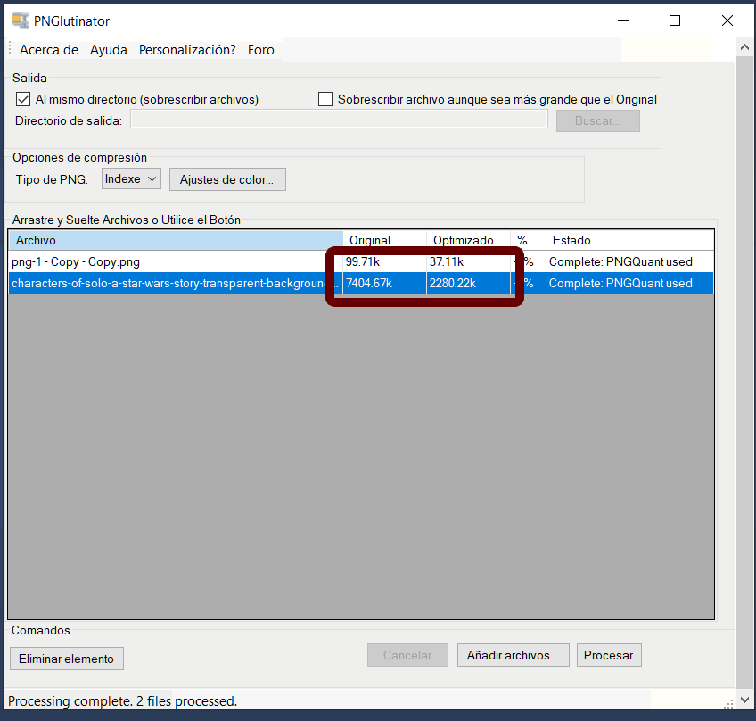
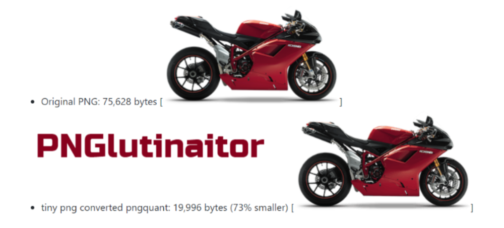

# SOCIAL OFFICE PNGLUTINATOR #

Social Office is a set free and open source tools for Social Media, Social Managers, Community Managers, by [Javier Cañon](https://www.javiercanon.com).

How does it work?
Excellent question! When you process a PNG (Portable Network Graphics) file, similar colors in your image are combined. This technique is called “quantization”. By reducing the number of colors, 24-bit PNG files can be converted to much smaller 8-bit indexed color images. All unnecessary metadata is stripped too. The result: better PNG files with 100% support for transparency. 

## What does it Do? ##

* In the average image, the file size is reduced by 50% - 70%. 
* You can’t spot the difference either! Use the optimized image to save bandwidth and loading time and your website visitors will thank you, and you BOOST YOUR SEO (search engine rankings).

## Philosophy of Javier Cañon
* KISS by design and programming. An acronym for "keep it simple, stupid" or "keep it stupid simple", is a design principle. The KISS principle states that most systems work best if they are kept simple rather than made complicated; therefore, simplicity should be a key goal in design, and unnecessary complexity should be avoided. Variations on the phrase include: "Keep it simple, silly", "keep it short and simple", "keep it simple and straightforward", "keep it small and simple", or "keep it stupid simple".

* Select the best tools for the job, use tools that take less time to finish the job.
* Productivity over complexity and avoid unnecessary complexity for elegant or beauty code.

* Computers are machines, more powerful every year, give them hard work, concentrate on being productive.

## Requeriments? ##

Windows 10.
.Net Framework 4.8.

## Community ##

* [Installers](https://github.com/JavierCanon/Social-Office-PNGlutinaitor/releases)
* [Website, videos, photos, docs, etc.](https://www.facebook.com/groups/social.office.scrm/)
* [Group](https://www.facebook.com/groups/social.office.scrm/)
* [Wiki](https://github.com/JavierCanon/Social-Office-PNGlutinaitor/wiki)
* [Issue - Bug Traking](https://github.com/JavierCanon/Social-Office-PNGlutinaitor/issues)

## pngquant ##
pngquant is a command-line utility and a library for lossy compression of PNG images.

The conversion reduces file sizes significantly (often as much as 70%) and preserves full alpha transparency. Generated images are compatible with all modern web browsers, and have better fallback in IE6 than 24-bit PNGs.

### Features ###

High-quality palette generation using a combination of vector quantization algorithms.
Unique adaptive dithering algorithm that adds less noise to images than the standard Floyd-Steinberg.
Easy to integrate with shell scripts, GUIs and server-side software.
Fast mode for processing large numbers of images.

Example:
* Original PNG: 75,628 bytes
* tiny png converted pngquant: 19,996 bytes (73% smaller)

## Pngcrush ##
Pngcrush is an optimizer for PNG (Portable Network Graphics) files. It can be run from a commandline in an MSDOS window, or from a UNIX or LINUX commandline.

Its main purpose is to reduce the size of the PNG IDAT datastream by trying various compression levels and PNG filter methods. It also can be used to remove unwanted ancillary chunks, or to add certain chunks including gAMA, tRNS, iCCP, and textual chunks.

## Based in PNGoo and Other Colaborators ##

(https://github.com/NikkiDelRosso/PNGoo):

My modifications of the PNGoo batch PNG processor: http://code.google.com/p/pngoo/

Still playing with the project - so far my changes are:
- Multithreading: the GUI no longer is unresponsive while processing, and four files may be processed simultaneously
- Improved GUI: Status text accompanied by a shiny progress bar, and a cancel button

Things I would like to add:
- Entire directory selection (not just this laggy "add files" Windows dialogue) with a recursive option
- Probably more.

## Authors ##

* pngquant is developed by Kornel Lesiński and contributors. It's based on code by Greg Roelofs and Jef Poskanzer.
* Some code from [NikkiDelRosso](https://github.com/NikkiDelRosso/PNGoo)
* Jake Archibald 2009, for PNGoo
* Social Office PNGlutinaitor by [Javier Cañon](https://www.javiercanon.com) 

## Bugs ##
Please submit bug reports or feature requests on GitHub.

Made with ❤️ by [Javier Cañon](https://www.javiercanon.com).